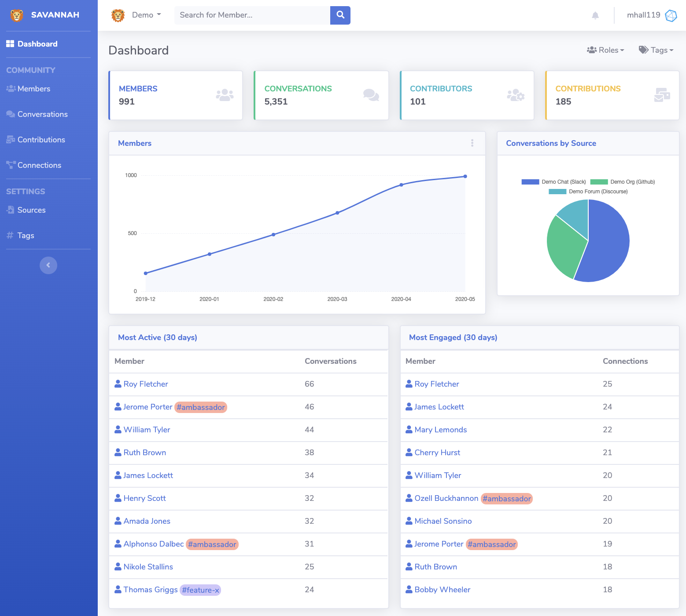

# Savannah

Learn more at [SavannahHQ.com](https://savannahhq.com)



Try a live demo at [demo.savannahhq.com](https://demo.savannahhq.com)!

## Create a Development environment

To get started running Savannah in your development environment, first create a Python virtualenv:

```
virtualenv --python=python3 ./env
```

Then install the requirements:

```
./env/bin/pip install -r requirements.txt
```

Next you'll need to initialize the database and create an admin account:

```
./env/bin/python manage.py migrate
./env/bin/python manage.py createsuperuser
```

This will create an SQLite database at ./db.sqlite in your local directory.

Finally run the development server:

```
./env/bin/python manage.py runserver
```

## Setting up Savannah

To log in to Savannah go to http://localhost:8000/login and log in.

Once logged in you will need to go to the Django admin (http://localhost:8000/admin) and create a new `Community` record.

You can now view the Savannah dashboard at http://localhost:8000/dashboard/1/

Savannah can import data from Slack, Github, Discourse and RSS feeds. To import, create a `Source` from the `Sources` page.


### Running importers

Once you've created your `Source` you can run the importers with

```
./env/bin/python manage.py import all
```

### Tagging data

You can create `Tags` for your members and conversations from the Django admin interface. If you specify keywords for your tag, all imported conversations will be checked for those keywords and, if found, that `Tag` will be automatically applied to them.

Some useful tags to consider are `thankful` with keywords `thanks, thank you`, and `greeting` with keywords `welcome, hello, hi`.

To auto-tag conversations & contributions, run:
```
./env/bin/python manage.py tag_conversations
./env/bin/python manage.py tag_contributions
```
